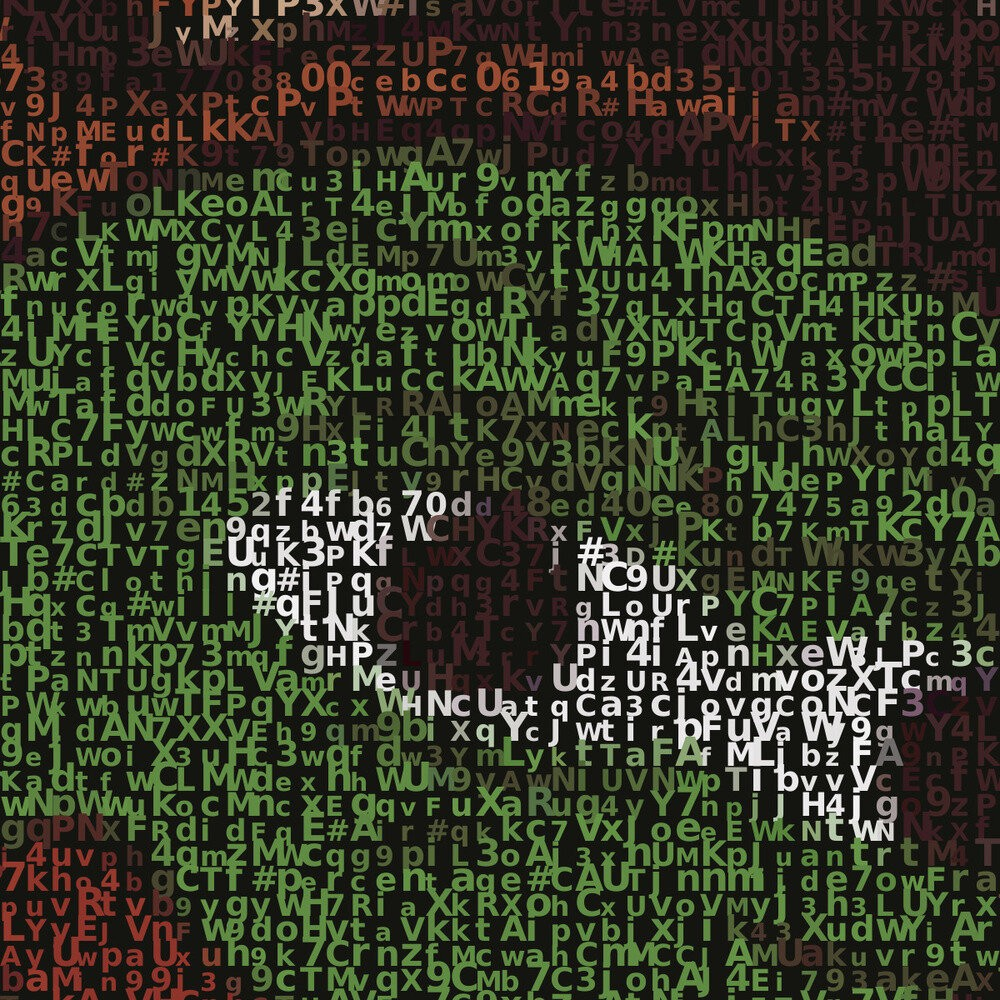
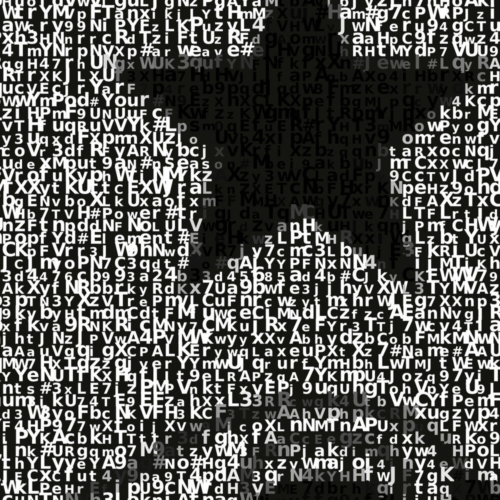
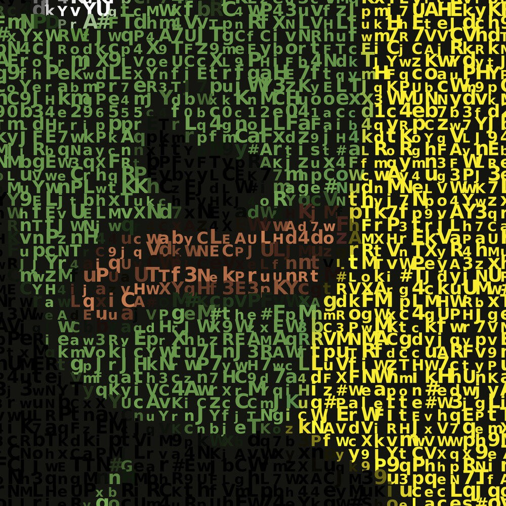
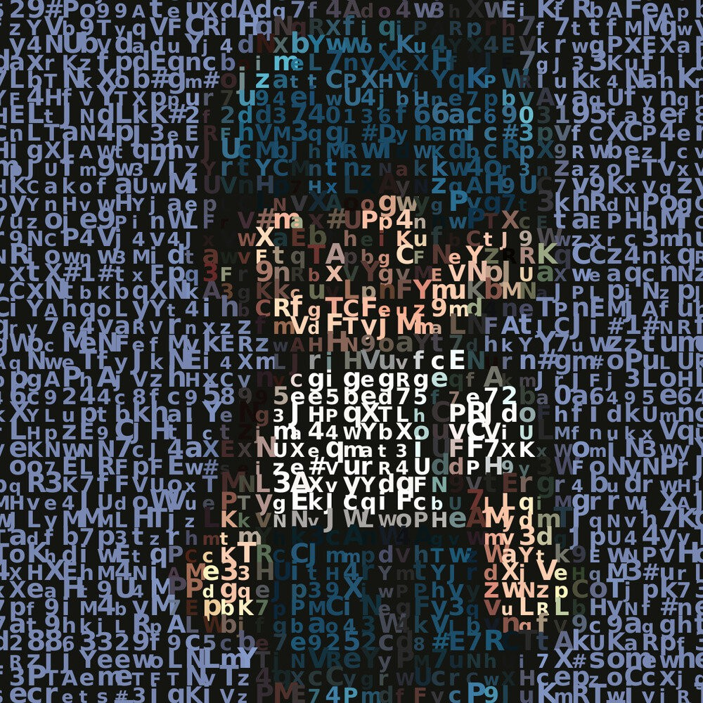

# Rememes as Code  
### Art Inspired by Chaos and Structure  

---

For starters, we want to express our sincere gratitude to the creators of the 6529 meme collection and all the talented artists who support and develop this movement. Memes released under the CC0 license have become an important part of Web3 culture, inspiring us to create our own Rememe collection.

---

## What is a Rememe?  
For us, a Rememe is a new perspective on an original work — an opportunity to present it in a different light or from a new angle, to find fresh meanings that are relevant to Web3.

---

## Web3 Evolution and Our Inspiration  
Over the last two years, the Web3 and NFT space has undergone significant changes. Amid the bear market and the exodus of participants, major technological innovations emerged. Ethereum’s network capabilities were updated, L2 solutions were introduced, and new platforms for NFT creators were launched. These changes gave us access to new tools and possibilities that we could only dream of before. However, one thing remained unchanged in this environment — artists continued to create and inspire, despite all the challenges.

It was during this time that the idea for our collection, titled “Rememes as Code,” was born.

---

## Why “Rememes as Code”?  
For us, Rememes are not just art, but also technology. Unlike traditional NFTs created using professional software, our collection was born from code. We used a text editor to write code and utilized open-source tools in the Linux environment. We wrote more than a dozen bash scripts, each playing its part in creating the collection:  

- A script for converting images into SVG code to adapt the originals to a new style.  
- A script for extracting metadata from the blockchain to preserve the digital legacy of the 6529 memes.  
- A script for downloading images from Arweave and converting GIFs to JPG.  
- Scripts for generating names and descriptions for each Rememe.  

We are excited to share some of the scripts we've created in our GitHub repository.

---

## NFTs as Encoded Messages  
The NFTs in our collection are not just images; they are encoded messages. Each NFT represents a high-resolution GIF animation that, at first glance, seems like a set of random symbols and numbers. But if you look closer, you can find encrypted metadata of the original and hidden messages inside. Below are a few fragments where the original memes are easily recognizable:  

**Sgt. Pepe**, Arsonic

**Come and Take It!**, VincentVanDough

**FTXPepe**, 6529er and 6529

**GM Everyone**, Deekay
  
---

## The Idea of Chaos and Structure  
Our concept is inspired by how chaos can contain hidden structure. Imagine a living organism at a molecular level: it seems unified from the outside, but at the microscopic level, it’s a collection of molecules that are constantly renewing. The organism remains itself because its DNA holds the information about its structure and function.  

In analogy with this process, we extracted a kind of "code" from the original memes and created a digital representation based on it — our Rememes. They combine the images and metadata of the originals, formed into GIF animations.

---

## Feelings and Inner Motivation  
We’ll be honest: as the final result approached, we became increasingly anxious. Would we be able to attract attention to our work? Would our creation resonate with the community? But through all the doubts, we realized why we were doing this:  

- Creation is an important process in itself, and working with the blockchain is our way of engaging with cutting-edge technology.  
- We are building not just a project but our own experience, finding meaning and value in every task.  
- We’re creating a collection we’d want to see and collect ourselves.  
- Whether the market is in a bear or bull phase doesn’t matter as long as we keep building.  
- Sales are a pleasant bonus, but their absence won’t stop us.  
- Support and feedback from the community — that’s what will be our greatest achievement. For now, we simply continue creating.

---

## Upcoming Drop Plans  
Our collection will launch on Base ([@base](https://x.com/base)), a fast-evolving Ethereum Layer 2 network that is rapidly gaining traction among creators and collectors. Its low transaction fees make it an ideal environment for experimentation and bringing innovative ideas to life.  

For minting, we’ve chosen Manifold ([@manifoldxyz](https://x.com/manifoldxyz)), a trusted platform renowned for its reliable tools and complete control over smart contracts. Manifold empowers creators to design unique collections while maintaining ownership of their contracts.

---

## Unique Drop Structure  
Drops will occur regularly from Monday to Friday, but without announced dates and times. We will release a Rememe for each meme from the original [6529 collection](https://6529.io/the-memes?sort=age&sort_dir=DESC). We’ve already prepared a series of 144 pieces.  

### Drop Details:  
| Drop Number | Mint Limit | Price (ETH) |  
|-------------|------------|-------------|  
| 1           | 6          | 0.0069      |  
| 2           | 7          | 0.00705     |  
| 3           | 8          | 0.0072      |  
| ...         | +1 token   | +0.00015    |  

---

## Airdrop and Accessibility  
Each drop includes 7 additional tokens designated for the airdrop. These tokens will be distributed as follows:  

- 2 tokens will be sent to the Museum.  
- 5 tokens will be sent to pre-prepared wallets, whose private keys are hidden within the Rememe code.

---

## Transparency and Honesty  
We openly state that Rememes do not serve any additional utility function and do not have a fixed material value. Purchase them if they resonate with you, if they have meaning and intangible value for you, and if you can afford it. Your support is important to us, but equally important is the honesty regarding the purpose of the tokens.

---

## Special Auction Announcement  
Before we kick off our releases, we want to share a unique opportunity that showcases both our intentions and the behind-the-scenes efforts of this project. For collectors and meme enthusiasts, we’ve prepared an exclusive auction in the Ethereum mainnet via Manifold featuring a 1/1 token — a high-resolution collage (16,000x9,000) composed of 144 fragments from the first series of Rememes in the upcoming collection.  

This piece is our tribute to the art and culture of Rememes and a glimpse into what lies ahead.  

Check out the auction on Manifold here 👉 [Rememes as Code - Part I](https://gallery.manifold.xyz/rememes-as-code-part-1)

---

## Final Thoughts  
Each drop is an experiment with Web3 culture, whose form and content blend chaos and structure. We invite the community to be a part of this journey, to explore the depths of Rememes, and to share our passion for creativity and technology. Join us, share your findings, and help us grow the culture of Rememes!  